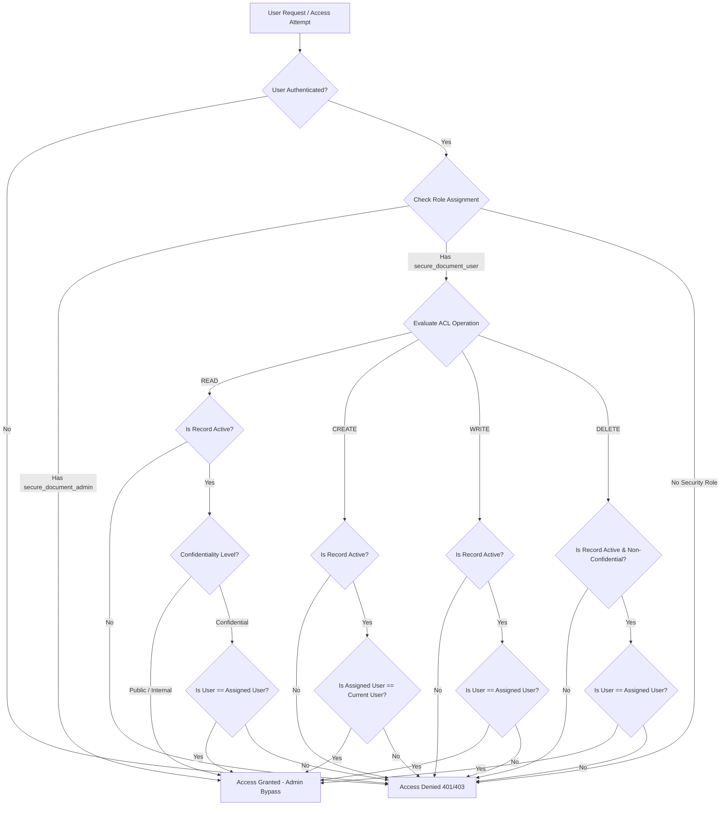

# System Architecture & Technical Specification

## Overview
The **Script-Controlled ACL System** provides fine-grained, dynamic access control for sensitive business documents inside ServiceNow. Access is dynamically determined at runtime based on the authenticated user's role assignment and field values on the target record (`u_assigned_user`, `u_confidentiality_level`, and `u_active`).

## Workflow Diagram

## Security Rule Matrix

| Operation | User Role | Record Active | Confidentiality Level | Assigned User Constraint | Outcome |
| :--- | :--- | :--- | :--- | :--- | :--- |
| **READ** | `secure_document_admin` | Any | Any | Any | **ALLOWED** |
| **READ** | `secure_document_user` | `true` | `public` / `internal` | Any | **ALLOWED** |
| **READ** | `secure_document_user` | `true` | `confidential` | Current User | **ALLOWED** |
| **READ** | `secure_document_user` | `true` | `confidential` | Other User | **DENIED** |
| **READ** | `secure_document_user` | `false` | Any | Any | **DENIED** |
| **CREATE**| `secure_document_admin` | Any | Any | Any | **ALLOWED** |
| **CREATE**| `secure_document_user` | `true` | Any | Current User | **ALLOWED** |
| **CREATE**| `secure_document_user` | `true` | `confidential` | Other User | **DENIED** |
| **WRITE** | `secure_document_admin` | Any | Any | Any | **ALLOWED** |
| **WRITE** | `secure_document_user` | `true` | Any | Current User | **ALLOWED** |
| **WRITE** | `secure_document_user` | `true` | Any | Other User | **DENIED** |
| **WRITE** | `secure_document_user` | `false` | Any | Any | **DENIED** |
| **DELETE**| `secure_document_admin` | Any | Any | Any | **ALLOWED** |
| **DELETE**| `secure_document_user` | `true` | `public` / `internal` | Current User | **ALLOWED** |
| **DELETE**| `secure_document_user` | `true` | `confidential` | Current User | **DENIED** |
| **DELETE**| `secure_document_user` | `false` | Any | Any | **DENIED** |
