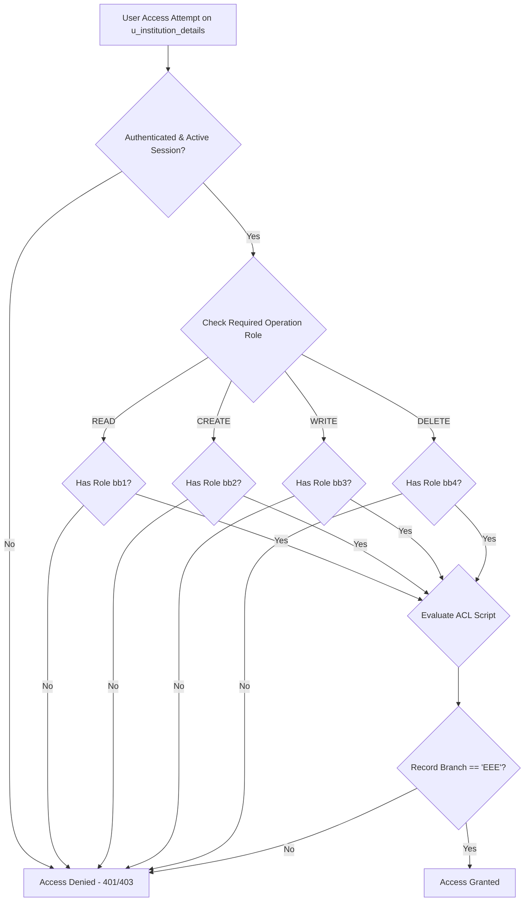

# System Architecture & Technical Specification

## Overview
The **Script-Controlled ACL System** provides fine-grained, dynamic access control for records in the `u_institution_details` table inside ServiceNow. Access is dynamically determined at runtime based on the authenticated user's assigned role (`bb1`, `bb2`, `bb3`, `bb4`) and field values on the target record (`current.branch == 'EEE'`).

## System Architecture Diagram

## Security Rule Matrix

| Operation | Target Table | Required Role | Script Condition | Access Granted |
| :--- | :--- | :--- | :--- | :--- |
| **READ** | `u_institution_details` | `bb1` | `current.branch == 'EEE'` | Yes (Only for EEE records) |
| **READ** | `u_institution_details` | `bb1` | `current.branch != 'EEE'` | Denied |
| **READ** | `u_institution_details` | None | Any | Denied |
| **CREATE** | `u_institution_details` | `bb2` | `current.branch == 'EEE'` | Yes (Only for EEE records) |
| **CREATE** | `u_institution_details` | `bb2` | `current.branch != 'EEE'` | Denied |
| **WRITE** | `u_institution_details` | `bb3` | `current.branch == 'EEE'` | Yes (Only for EEE records) |
| **WRITE** | `u_institution_details` | `bb3` | `current.branch != 'EEE'` | Denied |
| **DELETE** | `u_institution_details` | `bb4` | `current.branch == 'EEE'` | Yes (Only for EEE records) |
| **DELETE** | `u_institution_details` | `bb4` | `current.branch != 'EEE'` | Denied |
