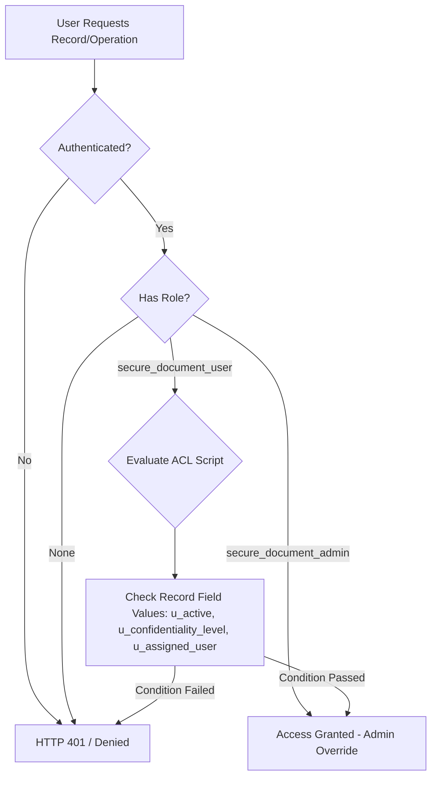

# Script-Controlled ACL – Restrict Record Access Based on Field Value

[](https://www.servicenow.com)
[](#)
[](LICENSE)

---

## 1. Project Overview
This project demonstrates how **Advanced Access Control Lists (ACLs)** in ServiceNow leverage server-side JavaScript to dynamically govern CRUD access to sensitive data records based on user roles and record-level field values (`u_assigned_user`, `u_confidentiality_level`, `u_active`).

---

## 2. Problem Statement
Standard role-based security in ServiceNow grants access uniformly based on assigned roles. However, enterprise data policies often mandate dynamic conditional security—where two users with the exact same role must see different subsets of records based on attributes such as record ownership, confidentiality tier, or lifecycle state.

---

## 3. Project Objectives
- Implement fine-grained, dynamic server-side security rules using ServiceNow Advanced ACLs.
- Prevent unauthorized read, creation, modification, and deletion of confidential documents.
- Mitigate security bypass vectors (e.g., field tampering, URL manipulation, aggregate list queries).
- Establish an enterprise-ready Update Set packaging structure for deployment across ServiceNow instance pipelines.

---

## 4. Technologies Used
- **Platform:** ServiceNow (Global Application Scope / Scoped App ready)
- **Security Framework:** Access Control Lists (ACL / Contextual Security)
- **Language:** Server-side JavaScript (ServiceNow Rhino / ES5 Engine)
- **Deployment:** ServiceNow Update Sets XML

---

## 5. Architecture & Flow Diagram



---

## 6. Security Roles

| Role Name | Scope | Capabilities / Purpose |
| :--- | :--- | :--- |
| `secure_document_user` | Global | Standard user access. Subject to field-level confidentiality & assigned user restrictions. |
| `secure_document_admin` | Global | Administrative access. Bypasses standard confidentiality restrictions for governance. |

---

## 7. Table Structure (`u_secure_documents`)

| Field Label | Field Name | Type | Reference / Values | Mandatory | Purpose |
| :--- | :--- | :--- | :--- | :--- | :--- |
| Number | `u_number` | Auto Number | Prefix: `DOC` | Yes | Primary record key |
| Short Description | `u_short_description` | String (100) | - | Yes | Document title |
| Description | `u_description` | HTML / String | - | No | Document contents |
| Assigned User | `u_assigned_user` | Reference | `sys_user` | Yes | Document owner |
| Confidentiality Level | `u_confidentiality_level` | Choice | `public`, `internal`, `confidential` | Yes | Security classification |
| Active | `u_active` | True/False | Default: `true` | Yes | Record state |

---

## 8. ACL Security Rule Summary

```text
READ:    Active & (Public | Internal | (Confidential & User == AssignedUser))
CREATE:  Active & (User == AssignedUser)
WRITE:   Active & (User == AssignedUser)
DELETE:  Active & Non-Confidential & (User == AssignedUser)
ADMIN:   Full Access for secure_document_admin
```

---

## 9. Installation & Deployment

### Quick Setup
1. Clone this repository to your local system.
2. Import the Update Set `Update_Sets/Script_Controlled_ACL_v1.xml` into your ServiceNow instance via **Retrieved Update Sets**.
3. Preview and Commit the Update Set.
4. Elevate privileges to `security_admin`.
5. Create test users (`secure.user` and `secure.admin`) and assign corresponding roles.

Detailed manual installation instructions are available in [`Documentation/Installation.md`](file:///c:/projects/clg/NM/service%20now/Documentation/Installation.md).

---

## 10. Test Scenarios & Matrix

Detailed test matrix and negative security scenarios are documented in [`Documentation/Testing.md`](file:///c:/projects/clg/NM/service%20now/Documentation/Testing.md).

---

## 11. Screenshots

Place instance verification screenshots in `Screenshots/`:
- `Screenshots/roles/` - Role definitions
- `Screenshots/table/` - Table schema & fields
- `Screenshots/acl/` - ACL definitions & scripts
- `Screenshots/authorized/` - Successful access
- `Screenshots/unauthorized/` - Denied access & row constraints

---

## 12. Security Considerations
- **Implicit Deny Default:** Scripts set `answer = false;` as the initial baseline.
- **Field-Level Protection:** Critical fields (`u_assigned_user`, `u_confidentiality_level`, `u_active`) have dedicated WRITE ACLs to block record ownership tampering.

---

## 13. Limitations & Future Improvements
- **Performance:** For high-volume tables, script-based ACL execution should minimize complex GlideRecord calls.
- **Future Enhancements:** Implement Query Business Rules for list-level query optimization alongside ACL enforcement.

---

## 14. Project Author
- **Developer / Author:** Senior ServiceNow Developer / Student Portfolio Project
- **Repository Structure:**
  - `Scripts/`: Raw JavaScript source files for table & field ACLs
  - `Documentation/`: Full technical specifications
  - `Update_Sets/`: XML deployment package
