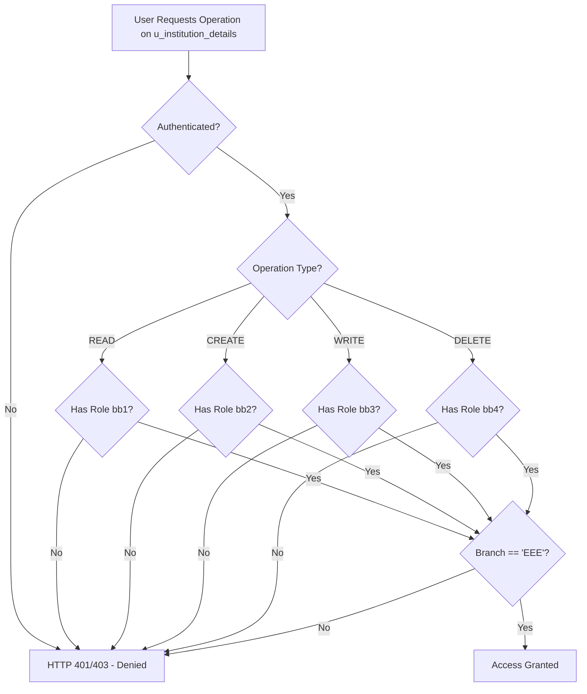

# Script-Controlled ACL – Restrict Record Access Based on Field Value

[](https://www.servicenow.com)
[](#)
[](LICENSE)

---

## 1. Project Overview
This project demonstrates how **Script-Controlled Access Control Lists (ACLs)** in ServiceNow leverage server-side JavaScript to dynamically govern CRUD access to records in the **`u_institution_details` (Institution Details)** table based on user security roles (`bb1`, `bb2`, `bb3`, `bb4`) and field values (`current.branch == 'EEE'`).

---

## 2. Problem Statement
Standard role-based security in ServiceNow grants access uniformly to all records in a table based solely on assigned roles. However, organizational requirements often mandate **dynamic field-level or value-based access restrictions**—for example, granting read, create, write, or delete permissions only when a record belongs to a specific department or branch (e.g. `Branch == 'EEE'`).

---

## 3. Code Base Architecture & Composition

In ServiceNow, your "code base" consists of **application metadata (configurations)** structured in Git via ServiceNow Studio rather than raw source code files alone:

### 1. Data Model (Table & Fields)
- **Custom Table:** `u_institution_details` (Institution Details)
- **Dictionary Fields:**
  - `Branch` (`u_branch` / `branch`)
  - `Description` (`u_description`)
  - `Email` (`u_email`)
  - `Faculty Name` (`u_faculty_name`)
  - `Phone Number` (`u_phone_number`)
  - `Student Name` (`u_student_name`)

### 2. Security Roles
- `bb1`: Grants Read ACL privileges (subject to script evaluation).
- `bb2`: Grants Create ACL privileges (subject to script evaluation).
- `bb3`: Grants Write ACL privileges (subject to script evaluation).
- `bb4`: Grants Delete ACL privileges (subject to script evaluation).

### 3. Access Control Lists (ACLs)
Four record-level security rules configured for `u_institution_details`:
- **Read ACL** (tied to role `bb1`)
- **Create ACL** (tied to role `bb2`)
- **Write ACL** (tied to role `bb3`)
- **Delete ACL** (tied to role `bb4`)

### 4. Advanced ACL Script Logic
JavaScript code inside each ACL that validates field values before granting access:
```javascript
// Example check evaluated in ACL script
if (current.branch == 'EEE' || current.u_branch == 'EEE') {
    answer = true;
} else {
    answer = false;
}
```

---

## 4. Architecture & Security Flow



---

## 5. Security Role & ACL Matrix

| Operation | Table | Role Required | Script Condition | Access Granted |
| :--- | :--- | :--- | :--- | :--- |
| **READ** | `u_institution_details` | `bb1` | `current.branch == 'EEE'` | Yes (Only for EEE records) |
| **CREATE** | `u_institution_details` | `bb2` | `current.branch == 'EEE'` | Yes (Only for EEE records) |
| **WRITE** | `u_institution_details` | `bb3` | `current.branch == 'EEE'` | Yes (Only for EEE records) |
| **DELETE** | `u_institution_details` | `bb4` | `current.branch == 'EEE'` | Yes (Only for EEE records) |

---

## 6. What is NOT Included in Git (Data vs. Code)

* **Test Users & Impersonation Profiles:** EEE test users created in `sys_user`.
* **Test Records:** Dummy records created inside `u_institution_details`.
* *ServiceNow Source Control packages structure and rules (metadata), not runtime transactional data.*

---

## 7. Review and Commit Instructions (ServiceNow Studio)

1. Open your [ServiceNow Instance Tab](https://dev441363.service-now.com/).
2. Type `studio` in the Filter Navigator and press Enter.
3. Select your application (**Script-Controlled ACL**).
4. Click **Source Control > Commit Changes**.
5. Select all modified tables, dictionary entries, roles, and ACLs.
6. Provide a commit message (e.g., `feat: complete u_institution_details ACL branch restrictions`) and push to your GitHub repository.

---

## 8. Repository Structure

- `Scripts/`: Server-side JavaScript files for ACL execution.
  - [`Read_ACL.js`](file:///c:/projects/clg/NM/service%20now/Scripts/Read_ACL.js)
  - [`Create_ACL.js`](file:///c:/projects/clg/NM/service%20now/Scripts/Create_ACL.js)
  - [`Write_ACL.js`](file:///c:/projects/clg/NM/service%20now/Scripts/Write_ACL.js)
  - [`Delete_ACL.js`](file:///c:/projects/clg/NM/service%20now/Scripts/Delete_ACL.js)
- `Documentation/`: Detailed technical specifications and guides.
- `Update_Sets/`: ServiceNow XML update set deployment files.
